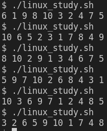

# DOC - HOME TASK

### 1.  Please design a script that writes the numbers from 1 - 10 in random order. Each number should appear only once. You can use bash only. Please provide tests for the script, along with documentation which should include the following:
 

> * Build instructions
> * Usage
> * Description
> * Known limitations / bugs

 
&nbsp;&nbsp;&nbsp;&nbsp;&nbsp;&nbsp;&nbsp;&nbsp;&nbsp;&nbsp;&nbsp;&nbsp;&nbsp;Considering that is a short code, we can explain with more details by steps what was used. 

The code: 

~~~bash
#!/bin/bash

# Initialize the main array
export array_seq

# Create a function to split and organize the code
# We will use a flag to control if we will append the number in array or not
# We will use the linux $RANDOM variable to generate random numbers. 
function generate_array(){
  control=0 
  num=$(echo $(( RANDOM % 10 + 1 ))) 
  array_seq+=(${num}) 
  # Control the array_seq length
  while [ "${#array_seq[*]}" -lt "10" ]
  do
    num=$(echo $(( RANDOM % 10 + 1 )))
    # Test if the random number already exists in the array_seq
    for n in ${array_seq[*]}
    do
      if [ "$num" -eq "$n" ]
      then
        control=0
        break
      else 
        control=1
      fi
    done
    # If control = 1, the random num will be appended in the array_seq
    if [ "$control " -eq "1" ]
    then
      array_seq+=(${num})
      control=0
    fi
  done
  echo ${array_seq[*]}

}

function main(){
  generate_array
}

main
~~~

  * 1 - Never forget the <b>SHEBANG</b>
  * 2 - We use export in case to avoid problems if some subshell is opened to work with the array array_seq
  * 3 - To organize the code, we work with functions. So we create one to generate the sequence called "generate_array" and another called main to run all that we built before.
  * 4 - We used a flag called control to, obviously, control something. In case it will control whether a random number will be appended or not array_seq.
  * 5 - To generate a random integer number from 1 to 10, we are using the $RANDOM internal Bash function. It's a simple function, but it fits to our case. Alternatively we could use shuf -i 1-10 -n 1.
  * 6 - Of course, if it's the first number, it can already be appended to the array_seq.
  * 7 - After the first number, we will use a while loop to control the length of the array_seq. While the length is not 10, the loop will keep running.
  * 8 - So, the most important part is the arrangement with a for loop and an if condition inside it. The for will make the random number that was generated in the instruction: 
~~~bash 
"num=$(echo $(( RANDOM % 10 + 1 )))" 
~~~
&nbsp;&nbsp;&nbsp;&nbsp;&nbsp;&nbsp;&nbsp;&nbsp;&nbsp;&nbsp;&nbsp;&nbsp;&nbsp;run over the entire array_seq to check/test if this number already exists or not in the array_seq. If it exists, control remains 0 and the for loop breaks. If it doesn't exist, the control flag will receive 1 and when the for loop finishes, this random number will be appended in the array_seq and the control flag will receive 0 again.
  
!!! Warning Don't forget to give the number 0 to flag control after a random number was appended in the array_seq

  * 9 - The last step will run till the array_seq has the length 10. When the while loop finishes, it just prints the array with the following instruction 
~~~bash
echo ${array_seq[*]}"
~~~

2. Add execute permission to script linux_study.sh

~~~bash
chmod +x linux_study.sh
~~~

3. Run the script

~~~bash
./linux_study.sh
~~~

We can see the result as we wanted.

  

<b>Image 01</b>: Script results

1. Conclusion

The script worked to the problem described. Obviously, it's the simplest implementation where we read the array_seq completely every time  that the for loop starts. If we consider big sequences, definitely, due to algorithms analysis and design, the solution described here is not the best one. 

Another point is that the $RANDOM bash script function runs pseudorandom integers in the range 0 - 32767. Of course, if we need some larger range, we should use other options.

 
 

### 2. Imagine a server with the following specs:
 

> * 4 times Intel(R) Xeon(R) CPU E7-4830 v4 @ 2.00GHz
> * 64GB of ram
> * 2 tb HDD disk space
> * 2 x 10Gbit/s nics

### The server is used for SSL offloading and proxies around 25000 requests per second. Please let us know which metrics are interesting to monitor in that specific case and how would you do that? What are the challenges of monitoring this?

1. Metrics interesting to monitor:

* Network Interface traffic
* Availability of the server itself (Network link, Network Interfaces, hardware in general, electricity, etc)
* Availability of SSL offloading solution.
* Proxies availability
* Memory used by the SSL offloading solution and memory used totally by the server.
* CPU used by the SSL offloading solution and CPU used totally by the server.
* Current opened connections (Active)
* New opened connections and how long usually they keep opened or how long it takes to be closed.
* Server load 
* Server temperature
* Server disk space
* Server disks iops
* SSL certificate expiration date

2. How would I monitor the list on topic 1? 

Using some monitor tool to make batch http requests to bring all the results at once. About network or http request monitor steps, due to the high number of requests per second, it's good to use some tool that doesn't run in the SSL offloading server to avoid increasing the use of the server features. In this case, Zabbix Monitoring Tool could use HTTP Agent (it runs in the Zabbix Server or Zabbix Proxy) to achieve what we want. And to server hardware metrics, Prometheus Monitoring Tool usually works with light jobs and exporters.

3. What are the challenges of monitoring this?

Probably, due to the high number of requests per second, this server works with a high load (cpu, io, network, etc. Definitely, the highest challenge about monitoring this server is finding a better way to avoid overload during the check and collect. This could affect the SSL Offloading native operation itself and could also give us false monitor metrics. 